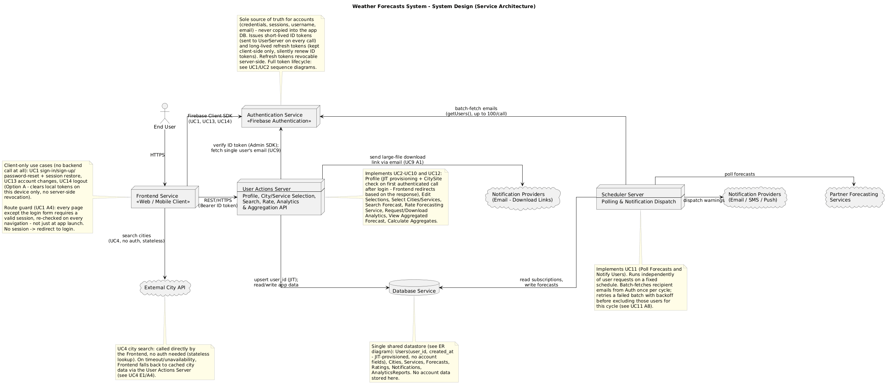
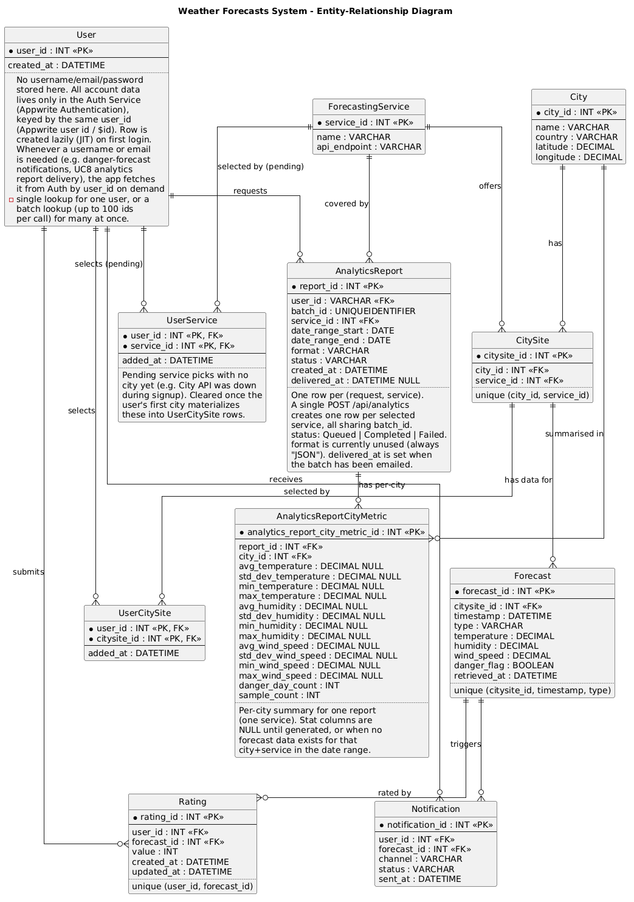

# Weather Forecasts AI — Remastered

A weather-aggregation platform that lets users track multiple cities across several partner
forecasting APIs, rates each partner's accuracy, surfaces the best-rated forecast per city, and
proactively warns subscribers about life-threatening conditions — built as two independently
deployable backend services sharing one SQL Server database, plus a React frontend.

[](https://github.com/ManosMorf97/Weather-Forecasts-AI-Remastered/actions/workflows/backend-ci.yml)


---

## What it does

- **Aggregates weather from 4 independent providers** (Open-Meteo, OpenWeatherMap, WeatherAPI,
  Visual Crossing) behind one common interface, normalized to the same units (°C, %, km/h, UTC).
- **Surfaces the best forecast per city** — the aggregated view picks the partner service with
  the highest user-rated accuracy for that city, not just the newest data.
- **Warns users proactively** — a scheduled job polls every subscribed (city, service) pair,
  detects life-threatening forecasts (CAP severity alerts), and emails each affected user exactly
  once per distinct danger record, even for hazards that existed before they subscribed.
- **Generates analytics reports asynchronously** — a background worker turns a user's request
  into per-city temperature/humidity/wind statistics and charts, rendered to a PDF and emailed,
  without blocking the HTTP request that triggered it.
- **Delegates authentication entirely to Appwrite** — the backend never issues or stores
  passwords; it verifies each caller's JWT server-side, live, on every request.

## Architecture

Two backend services, deliberately **not** calling each other — the only thing they share is the
SQL Server schema (owned by `WeatherUserActions`' EF Core migrations) — plus a frontend that talks
to `WeatherUserActions` over HTTP.



| Service | Role | Stack |
|---|---|---|
| [`WeatherUserActions`](backend/WeatherUserActions) | User-facing REST API: profiles, city/service selection, forecast search, ratings, aggregated forecasts, analytics reports | ASP.NET Core (.NET 10), EF Core, MailKit, QuestPDF, ScottPlot |
| [`PredictionUpdater`](backend/PredictionUpdater) | Run-once scheduler job (UC11): one process start = one poll → store → notify cycle, then exit; an external scheduler owns the interval | Node.js + TypeScript, Prisma, Zod |
| [`WeatherAppUserInterface`](frontend/WeatherAppUserInterface) | React frontend: auth screens, routing/guards, profile provisioning (UC2) | React 19, TypeScript, Vite, Bootstrap |

All three connect to the same **Appwrite** project for authentication — the frontend talks to
Appwrite directly for sign-up/login/token refresh (UC1, UC13, UC14), and `WeatherUserActions`'s
only auth job is to verify the bearer token it receives by calling Appwrite's own `account.get()`,
rather than trusting a client-decoded JWT.

## Use cases

<details>
<summary><strong>14 use cases</strong>, each documented in <a href="requirements/usecase_analysis">requirements/usecase_analysis</a> with actors, flows, alternative paths and postconditions</summary>

| # | Use case |
|---|---|
| UC1 | Login / Sign Up |
| UC2 | Create Profile |
| UC3 | Edit Selections |
| UC4 | Select Cities |
| UC5 | Select Forecasting Services |
| UC6 | Search Forecast |
| UC7 | Rate Forecasting Service |
| UC8 | Request Analytics (async, emailed as PDF) |
| UC9 | Download Analytics *(planned: on-demand, JSON/CSV/PDF)* |
| UC10 | View Aggregated Forecast (best-rated service per city) |
| UC11 | Poll Forecasts & Notify Users (the scheduler job) |
| UC12 | Calculate Aggregates |
| UC13 | Change Authentication Details |
| UC14 | Logout |

</details>

## Engineering highlights

- **Tests hit a real database, not mocks.** Both services use Testcontainers to spin up an actual
  SQL Server instance for repository/integration tests — including asserting on the exact rows
  written, not just that a call "succeeded."
- **Provider adapters are honest about their own limits.** Each weather API adapter is a pure
  `response → NormalizedForecast[]` function behind a shared interface, independently unit
  tested with realistic fake payloads. One provider only offers 3-hourly data, so it simply
  emits no `HOURLY` row rather than fabricating one — a documented, deliberate trade-off, not
  an oversight.
- **Danger detection is CAP-alert-driven**, not a heuristic — providers that expose alerts (CAP
  `severity` + effective/expiry window) drive the `danger` flag; providers with no alert feed
  honestly report `danger: false` instead of guessing.
- **Async work doesn't block requests.** Analytics report generation (DB query → statistics →
  charts → PDF → email) can take tens of seconds, so the controller returns `202 Accepted`
  immediately and a background worker (`AnalyticsReportWorker`) drives the job to completion.
- **~195 automated tests** across all three parts (150 xUnit tests in `WeatherUserActions.Tests`,
  33 Vitest tests in `PredictionUpdater`, 16 Vitest + React Testing Library tests in
  `WeatherAppUserInterface`), run in CI on every push/PR.
- **CI only builds what changed** — a path-filtered GitHub Actions pipeline
  ([`backend-ci.yml`](.github/workflows/backend-ci.yml)) runs each part's lint/build/test job only
  when files under that part actually changed.

## Data model



## Repository layout

```
backend/
  WeatherUserActions/     ASP.NET Core API — profiles, forecasts, ratings, analytics, aggregation
    WeatherUserActions/         Controllers, Services, Repositories, EF Core Models & Migrations
    WeatherUserActions.Tests/   xUnit: controller-logic, repository (real DB), full HTTP journeys
  PredictionUpdater/      Node/TS scheduler job — poll, store, notify (see its own README for detail)
    src/providers/              One adapter per partner weather API, normalized to one shape
    src/pipeline/                Poll → store → notify, orchestrating the repositories
    test/                       Vitest: provider unit tests + Testcontainers repository tests
frontend/
  WeatherAppUserInterface/  React + Vite frontend — auth screens, routing guards, profile sync
    src/auth/                   Auth context/hooks/components, plus their Vitest + RTL tests
requirements/              Use-case analysis, ER diagram, sequence/activity diagrams, system design
.github/workflows/         CI
```

## Getting started

Each part is self-contained and has its own setup instructions:

- [`backend/WeatherUserActions/README.md`](backend/WeatherUserActions/README.md) *(ASP.NET Core API)*
- [`backend/PredictionUpdater/README.md`](backend/PredictionUpdater/README.md) *(scheduler job)*
- [`frontend/WeatherAppUserInterface`](frontend/WeatherAppUserInterface) *(React + Vite app)* —
  `npm install && npm run dev` (or `npm test` for the Vitest + React Testing Library suite)

All three expect the same machine-level environment variables for the shared SQL Server connection
and Appwrite project (`YOUR_SERVER` / `YOUR_USER` / `YOUR_PASSWORD`, `YOUR_APPWRITE_*`) — see either
backend README for the full list. Two more matter specifically for local frontend/backend wiring:

- `YOUR_API_URL` — leave **unset** for local dev; the frontend then calls the backend through
  Vite's dev proxy (`vite.config.ts`), which needs no CORS. Set it only when the frontend and
  backend are genuinely separate origins (production, or calling the backend directly).
- `YOUR_FRONTEND_URL` — the frontend origin `WeatherUserActions` allows via CORS; only needed when
  `YOUR_API_URL` is set (i.e. the proxy isn't in the picture).

## Documentation

Full requirements analysis, per-use-case specs, sequence/activity diagrams and the system design
source live in [`requirements/`](requirements).
